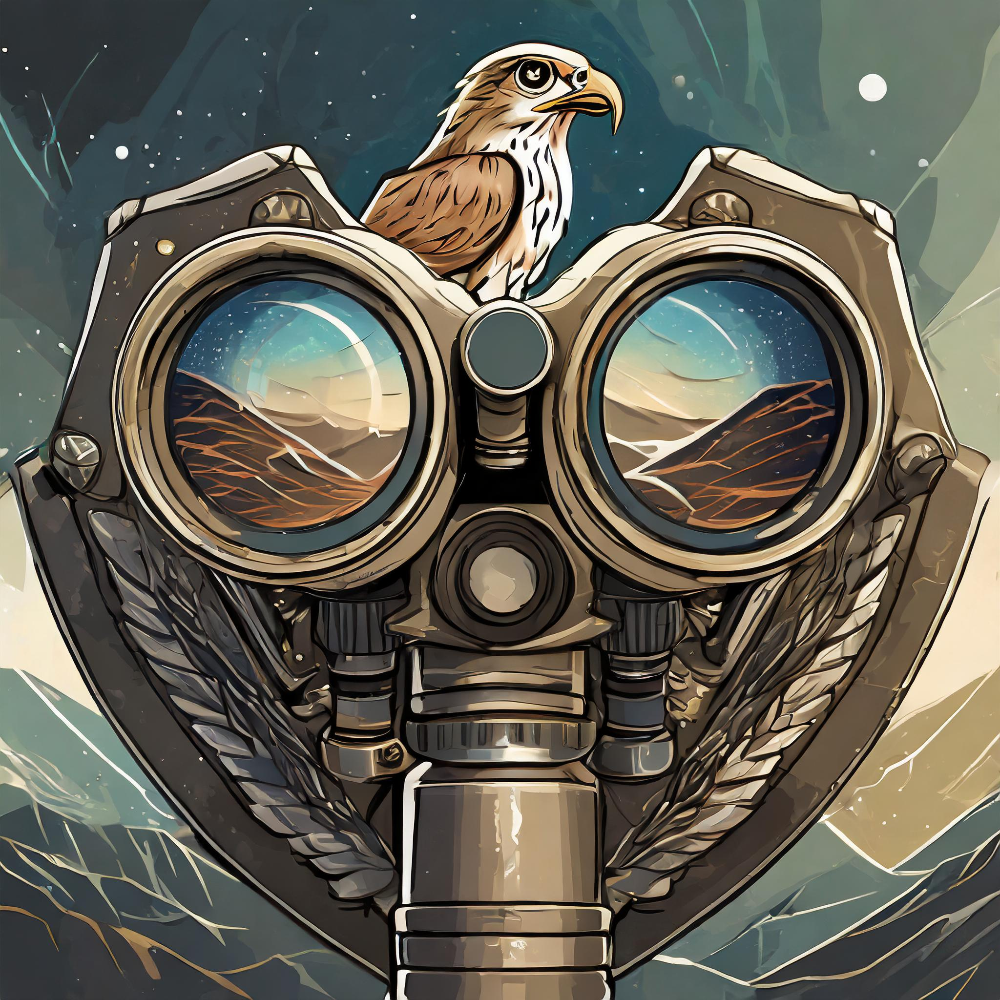

#   Binoculars: Zero-Shot Detection of LLM-Generated Text [[paper]](https://arxiv.org/abs/2401.12070)[[demo]](https://huggingface.co/spaces/tomg-group-umd/Binoculars)

<p align="center">
  
</p>

We introduce Binoculars, a state-of-the-art method for detecting AI-generated text. Binoculars is a
zero-shot and domain-agnostic (requires no training data) method. It is based on a simple idea: most
decoder-only, causal language models have a huge overlap in pretraining datasets, for e.g. Common Crawl, Pile, etc.
More details about the method and results can be found in our paper **Spotting LLMs with Binoculars: Zero-Shot
Detection of Machine-Generated Text**.

## Getting Started

### Installation

To run the implementation of Binoculars, you can clone this repository and install the package using pip. This code was
developed and tested on Python This code was developed and tested with Python 3.9. To install the package, run the
following commands:

```bash
$ git clone https://github.com/ahans30/Binoculars.git
$ cd Binoculars
$ pip install -e .
```

### Usage

Please note, this implementation comes with a fixed global threshold that is used to classify the input as AI-generated
or not. This threshold is selected using _Falcon-7B_ and _Falcon-7B-Instruct_ models for scoring. If you want to
use different scoring models, you can pass it as an argument to the `Binoculars` class. Please read the paper for more
details about the Binoculars work.

To detect AI-generated text, please use the following code snippet:

```python
from binoculars import Binoculars

bino = Binoculars()

# ChatGPT (GPT-4) output when prompted with “Can you write a few sentences about a capybara that is an astrophysicist?"
sample_string = '''Dr. Capy Cosmos, a capybara unlike any other, astounded the scientific community with his 
groundbreaking research in astrophysics. With his keen sense of observation and unparalleled ability to interpret 
cosmic data, he uncovered new insights into the mysteries of black holes and the origins of the universe. As he 
peered through telescopes with his large, round eyes, fellow researchers often remarked that it seemed as if the 
stars themselves whispered their secrets directly to him. Dr. Cosmos not only became a beacon of inspiration to 
aspiring scientists but also proved that intellect and innovation can be found in the most unexpected of creatures.'''

print(bino.compute_score(sample_string))  # 0.75661373
print(bino.predict(sample_string))  # 'Most likely AI-Generated'
```

In the above code, user can also pass a `list` of `str` to `compute_score` and `predict` methods to get results for
the entire batch of samples.

### Demo

We have also made a demo available to predict AI-generated text interactively with a simple UI
using [gradio](https://github.com/gradio-app/gradio). You can run the demo using the following command:

```bash
$ python app.py
```

## Limitations

All AI-generated text detectors aim for accuracy, but none are perfect and can have multiple failure modes (e.g.,
Binoculars is more proficient in detecting English language text compared to other languages). This implementation is
for academic purposes only and should not be considered as a consumer product. We also strongly caution against using
Binoculars (or any detector) without human supervision.

## Cite our work

If you find this work useful, please cite our paper:

```bibtex
@misc{hans2024spotting,
      title={Spotting LLMs With Binoculars: Zero-Shot Detection of Machine-Generated Text}, 
      author={Abhimanyu Hans and Avi Schwarzschild and Valeriia Cherepanova and Hamid Kazemi and Aniruddha Saha and Micah Goldblum and Jonas Geiping and Tom Goldstein},
      year={2024},
      eprint={2401.12070},
      archivePrefix={arXiv},
      primaryClass={cs.CL}
}
```
